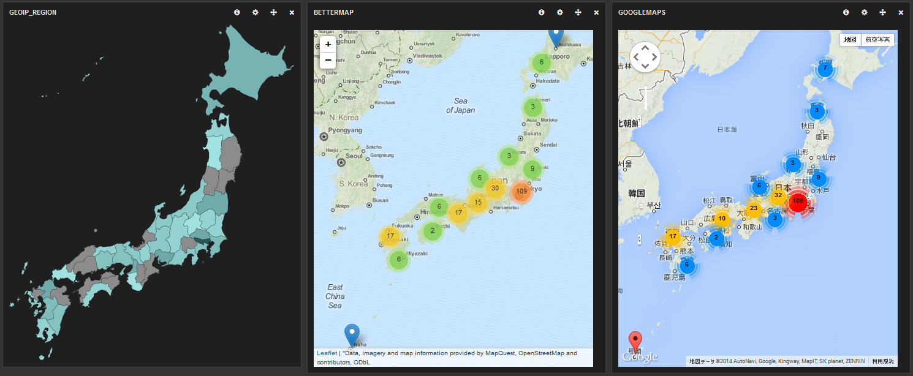

kibana_googlemaps
=================

GoogleMaps panel for Kibana3 forked from Bettermap.



# Install
- Setup a web server such as Apache httpd and Nginx.
- Setup Kibana3.
```
git clone https://github.com/elasticsearch/kibana .
cp src/* /path/to/kibana
```
- Install async plugin of require.js. It is needed for GoogleMaps to work with require.js.
```
cd /path/to/kibana/vendor/require
wget --no-check-certificate https://raw.github.com/millermedeiros/requirejs-plugins/master/src/async.js
```
- Edit require.config.js to enable async plugin.
```
cd /path/to/kibana/app/components
vi require.config.js
```
```
around line 14
...
    async: '../vendor/require/async',
...
```
- Install GoogleMaps panel.
```
cd /path/to/kibana/app/panels
mkdir googlemaps
cd googlemaps
git clone https://github.com/shakemid/kibana_googlemaps .
```
- Edit config.js to enable googlemaps.
```
cd /path/to/kibana
vi config.js
```
```
around line 68
...
    'googlemaps'
...
```

# Usage
Currently it has same options as Bettermap. So, maybe it can be used as well as Bettermap.

# ToDo
- IE support.

# Changes
## 0.0.1 (2014-03-11)
- Initial commit

## 0.0.1a (2014-03-12)
- Added fitBounds for GoogleMaps
- Added gridSize, maxZoom for MarkerClusterer
- Fix css for GoogleMaps buttons

# Links
- ElasticSearch: http://www.elasticsearch.org/
- Kibana3: https://github.com/elasticsearch/kibana/
- GoogleMaps Marker Clusterer: http://google-maps-utility-library-v3.googlecode.com/svn/trunk/markerclusterer/
- RequireJS plugins: https://github.com/millermedeiros/requirejs-plugins/

# Author
K.Cima k-cima[at]kendama.asia

# License
Licensed under the Apache License, Version 2.0 (the "License"); you may not use this file except in compliance with the License. You may obtain a copy of the License at

http://www.apache.org/licenses/LICENSE-2.0

Unless required by applicable law or agreed to in writing, software distributed under the License is distributed on an "AS IS" BASIS, WITHOUT WARRANTIES OR CONDITIONS OF ANY KIND, either express or implied. See the License for the specific language governing permissions and limitations under the License.
